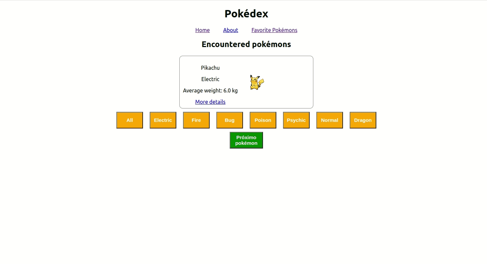

# React Testing Library

Essa aplicação foi feita usando React, jest e react testing library (RTL).

Aplicação que consiste em escrever testes que garantam a corretude do projeto.

## 🚀 Tecnologia

- ⚡ JavaScript é uma linguagem de programação interpretada estruturada, de script em alto nível com tipagem dinâmica fraca e multiparadigma.

- ⚡ Jest é um framework de teste unitário de código aberto em JavaScript criado pelo Facebook a partir do framework Jasmine.

- ⚡ React Testing Library (RTL) é uma biblioteca voltada para testar cada um dos componentes React que o desenvolvedor utilizar.

## ✋🏻 Pré-requisitos

- [git](https://git-scm.com/downloads): Ferramenta para gerenciar o código-fonte

- [Visual Studio Code](https://code.visualstudio.com/): Editor de Código Fonte

- [React](https://reactjs.org/): Biblioteca JavaScript para criar interfaces de usuário

## :hammer_and_wrench: Antes de iniciar o projeto.

No diretório do projeto, instale as dependências e inicialize o projeto:

### `npm install`

Instala as dependências.

### `npm start`

Executa o aplicativo no modo de desenvolvimento.

Abra [http://localhost:3000](http://localhost:3000) para visualizá-lo em seu navegador.

### `npm test`

Executa todos os testes presentes na aplicação.
